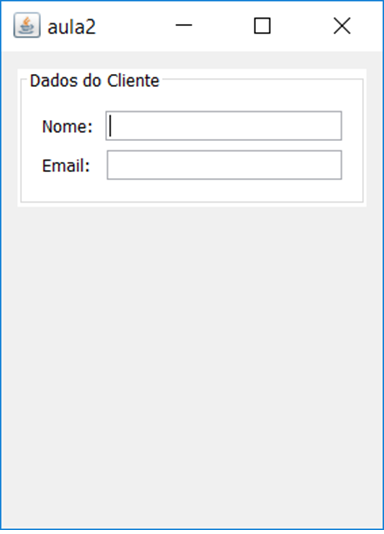
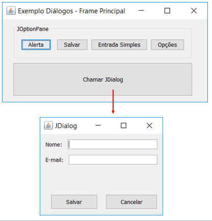

# Aula- Introdução a Janelas
Objetivo: Apresentar o funcionamento e os tipos de janelas no Netbeans

### Tarefa 1 - JFrame - Tamanho da janela
1.1 Altere o tamanho da janela JFrameCustomizadoView:
* Defina a largura como 300 pixels e a altura para 400 pixels (300x400).
  * Você pode clicar no JFrame e arrastar para mudar as dimensões ou clicar na aba "Propriedades" > "Código" > "Tamanho do Designer"
* Defina a propriedade ***preferredSize*** para o mesmo tamanho.
* No construtor da classe (JFrameCustomizadoView()), inclua o código para centralizar a janela conforme trecho a seguir:
<code>setLocationRelativeTo(null);</code>

### Tarefa 2 - Painéis
* Adicione um painel (JPanel) ao formulário contendo dois rótulos (JLabel), sendo Nome e E-mail.
* Adicione um campo de texto (JTextField) para cada rótulo. 
* Altere o título do formulário para **"aula2"**.
* Altere a propriedade **borda** do painel para **"Borda com título"**. Defina o título como **"Dados do Cliente"**
* Altere o fundo do painel para branco
* Utilize o protótipo a seguir como referência <br />


* Na classe "Main" do projeto:
  * Defina a aparência padrão para WindowsLookAndFeel. Utilize a dica do IDE e Circunde a instrução com try-catch.
<code>UIManager.setLookAndFeel(new WindowsLookAndFeel());</code>
  * Crie um objeto do JFrame e abra-o maximizado.
```
  JFrameCustomizadoView telaInicial = new JFrameCustomizadoView();
  telaInicial.setExtendedState(java.awt.Frame.MAXIMIZED_BOTH);
  telaInicial.setVisible(true);
```

### Tarefa 3 - Caixas de Diálogo
* Adicione um painel (JPanel) ao JFrame **"ExemploDialogosView"**
- Adicione 5 botões a este painel:
  - Botão "Alerta" e implemente o seguinte código ao clicá-lo <br />
  `JOptionPane.showMessageDialog(null, "Alerta“,"Message Dialog", JOptionPane.WARNING_MESSAGE);`
   - Botão "Salvar" e implemente o seguinte código ao clicá-lo
    ```
    int retorno= (int)JOptionPane.showConfirmDialog(null,"Deseja Salvar? ", "Título",JOptionPane.YES_NO_CANCEL_OPTION,JOptionPane.QUESTION_MESSAGE);
    ```
    - Botão "Entrada Simples" e implemente o seguinte código ao clicá-lo <br />
    `String retorno = JOptionPane.showInputDialog(null, "Digite seu nome:");`
    - Botão "Opções" e implemente o seguinte código ao clicá-lo <br />
    ```
    int escolha = JOptionPane.showOptionDialog(null,            //Componente pai
                               "Qual sistema de medidas usar?", //mensagem,
                               "Escolha uma opção",             //Título
                               JOptionPane.YES_NO_OPTION,       //int optionType
                               JOptionPane.INFORMATION_MESSAGE, //Tipo de Mensagem
                               null,                            //Icon icon
                               new Object[]{"Km","Milhas","Polegadas","Jardas"},  //Object[] opções,
                               "Km");                                             //Object initialValue 
    ```
    - Botão "Chamar JDialog" com o seguinte código:
    ```
    ExemploJDialogView dialogoView = new ExemploJDialogView(this,true); 
    dialogoView.setVisible(true);
    ```
    
- Utilize o protótipo a seguir como referência <br />

