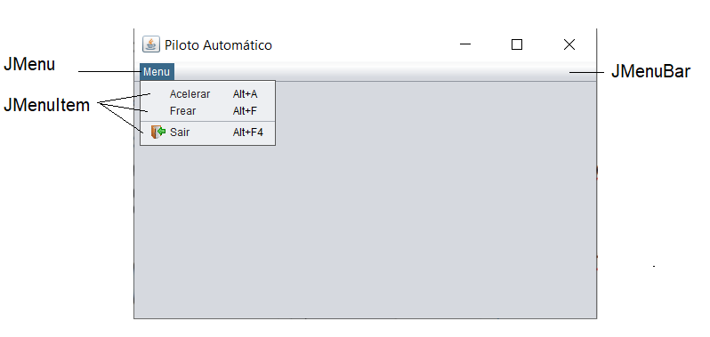
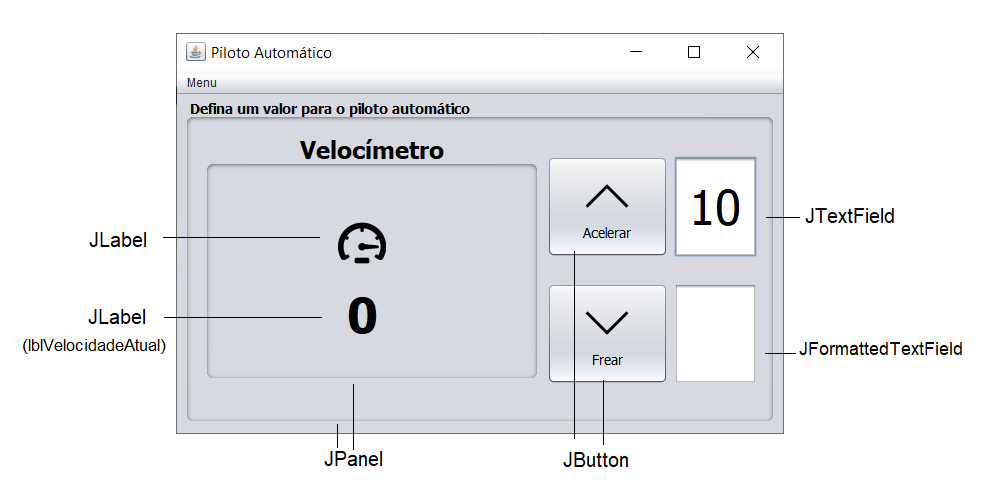

# Aula4 - Introdução a Controles Swing e Menus
Objetivo: Apresentar o funcionamento dos controles básicos do pacote gráfico do java swing

### Tarefa 1 - Trabalhando com Menus

1.1 - Adicione a este formulário 1 controle _JMenuBar_ e 1 controle _JMenu_ com o textos “Menu” conforme protótipo acima.  

1.2 - No Menu Principal, adicione 3 controles _JMenuItem_ com os textos "Acelerar", "Frear" e "Sair"  

1.2.1 - Adicione ao menu "Acelerar" um atalho (_accelerator_) com a combinação Alt+A.

1.2.2 - Adicione ao menu "Frear" um atalho (_accelerator_) com a combinação Alt+F.

1.2.2 - Adicione o ícone "sair.png" ao menu "Sair" e adicione um atalho (_accelerator_) com a combinação Alt+F4.

### Tarefa 2 - Botões, Caixas de Texto e Imagens

* Utilize o protótipo a seguir como referência  

2.1 Adicione um _JLabel_, uma caixa de texto _JTextField_ e um _JFormattedTextField_ ao formulário ***"AceleradorView"*** para informar a velocidade a ser incrementada (com 2 dígitos), observando as seguintes regras:

2.2 Adicione um _JLabel_ para exibir a velocidade atual chamado de lblVelocidadeAtual

2.3 Adicione 2 botões “btnAcelerar” e “btnFrear” com ícones (seta-cima.png e seta-baixo.png) e um _JLabel_ com a imagem “velocidade.png”.

2.4 Ao clicar no btnAcelerar, se a caixa de texto ao lado do botão estiver vazia, incremente de 10 em 10 a velocidade atual do objeto ***meucarro*** usando o método ***acelerar()*** sem parâmetros.
* Para validar se o JTextField ou JFormattedTextField estão vazios, utilize: <code> if(nomeObjTextField.getText().trim().equals("")) </code>
* Se a caixa de texto for preenchida, incremente a velocidade do objeto ***meucarro*** com o valor informado na caixa de texto, usando o método ***acelerar(int velocidade)***

2.5 Exiba a velocidade no _JLabel_ “lblVelocidadeAtual”

2.6 Repita os passos 2.4 e 2.5 para o botão frear, só que ao invés de usar o método ***acelerar()***, utilize o método ***frear()***

2.7 Repita os passos 2.4 e 2.5 ao clicar nos menus Acelerar e Frear.
