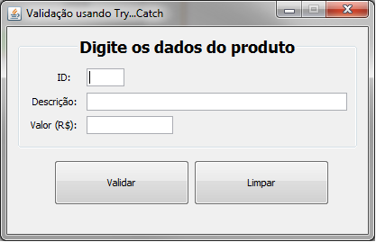
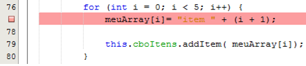

# Aula 6 - Tratamento de Erro e Depuração de Código
Apresentar formas de tratar a entrada do usuário.

### Tarefa 1 - Conversão de tipos

1.1 Ao clicar no botão "Salvar", faça as seguintes validações:
* ***ID*** - Validar se o usuário digitou um número inteiro – Use um bloco _trycatch_ para esta validação
* ***Descrição*** - Validar se o campo está preenchido  
<code>txtDescricao.getText().trim().equals("")</code>
* ***Valor*** - Validar se o usuário digitou um valor do tipo _double_ – Use um bloco _trycatch_ para esta validação.

1.2 Caso algum campo não passe na validação, exiba uma mensagem para o usuário do que ele deve digitar em cada campo.

1.3 Altere as validações anteriores para utilizar a classe de validação localizada no pacote _utils_

### Tarefa 2 - Opcional - Depuração de código
2.1 Faça as seguintes alterações ao formulário "ExemploDebbugerView":
* Ao clicar no botão "Gerar itens na Lista", crie um vetor de 5 dimensões do tipo _String_ Ex: 
<code>String[] meuArray = new String[5];</code>
* Utilize um _loop_ _for_ para preencher o vetor com os textos "item 1", "item2" até o "item 5"
* Adicione um breakpoint na primeira linha do _loop_

* Inicie a depuração do projeto (_Ctrl_ + _F5_) ou do arquivo (_Ctrl_ + _Shift_ + _F5_)
* Acompanhe cada iteração do _Loop_ para visualizar o preenchimento do vetor. 

Dica: Use os atalhos _F7_ para entrar no _loop_ ou _F8_ para ir para linha seguinte
