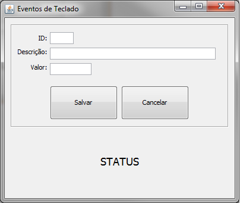

# Aula9 - Tratamento de Eventos
Apresentar conceitos de tratamento de eventos

### Tarefa 1 - Eventos de Teclado



1.1 Faça os seguintes tratamentos nos campos abaixo:
* ***ID*** - Faça a conversão para inteiro apenas se o campo for diferente de vazio no evento ***“KeyReleased”*** e use um bloco _trycatch_.

```
//Validar se o campo está preenchido
if(!txtID.getText().trim().equals("")){
  try{
     //Escreva aqui o código para conversão
  }catch(Exception e){
    //Escreva aqui a mensagem para o usuário
  }
  
}

```

no evento ***“KeyTyped”*** - Valide se o campo é inteiro, se não for exiba uma mensagem para o usuário no campo status: <br />
```
 //Permitir somente caracteres numéricos
 char c = evt.getKeyChar();
        
 if ( ((c < '0') || (c > '9')) && (c !=KeyEvent.VK_BACK_SPACE))
 {
    evt.consume(); 
    lblStatus.setText("Campo ID permite somente números!");
 }

```
  
* ***Descrição*** - Se o campo estiver diferente de vazio, altere o texto para letras maiúsculas no evento ***“KeyReleased”*** . Ex: </br>
<code>txtDescricao.setText(this.txtDescricao.getText().toUpperCase());</code>

Limitar o tamanho do campo para o máximo de 10 caracteres. Não permitir apóstrofe. Faça estas validações no evento ***"KeyTyped"***
```
//Validar tamanho máximo do campo
if(txtDescricao.getText().length()>=10)
{
    evt.consume();
    lblStatus.setText("Máximo de 10 caracteres atingido!");
}
```

```
//Não permitir Apóstrofe (Vulgarmente chamado de aspas simples)
if (evt.getKeyChar() == '\'') {
    evt.consume();
    lblStatus.setText("Não é permitido apóstrofe!");
    return;
 }
```

* ***Valor*** - Permitir somente números. Utilizar evento ***"KeyTyped"***
```
char c = evt.getKeyChar();
if ( ((c < '0') || (c > '9')) && (c !=KeyEvent.VK_BACK_SPACE))
{
     evt.consume(); 
}
```

### Tarefa 2 - Eventos de Mouse


2.1 Altere a cor de fundo do campo _JTextArea_ para amarelo ao passar o mouse sobre a caixa de texto. Utilize o evento ***“mouseEntered”*** <br />
<code>this.txtConteudo.setBackground(Color.yellow);</code>

2.2 Ao deixar a caixa de texto, defina a cor de fundo como branca. Utilize o evento ***“mouseExited”*** <br />
<code>this.txtConteudo.setBackground(Color.white);</code>

2.3 Exiba a localização do cursor ao passar pelo JPanel. No evento ***"mouseClicked"*** do JPanel adicione a seguinte linha de código: <br />
<code>lblStatus.setText(String.format("Clicou em [%d, %d]",evt.getX(),evt.getY()) );</code>

2.4 Exiba a localização do cursor ao clicar no JPanel. No evento ***"mousePressed"*** do JPanel adicione a seguinte linha de código: <br />
<code>lblStatus.setText(String.format("Pressionado em [%d, %d]",evt.getX(),evt.getY()) );</code>

2.5 Exiba a localização do cursor ao soltar o clique do mouse no JPanel. No evento ***"mouseReleased"*** do JPanel adicione a seguinte linha de código: <br />
<code>lblStatus.setText(String.format("Soltou em [%d, %d]",evt.getX(),evt.getY()) );</code>


