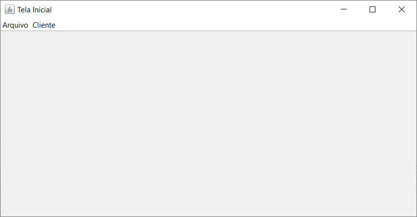
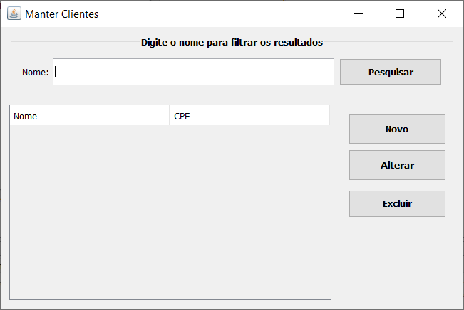

# Lab 8 - JDBC com preparedStatement e classe utilitária de Conexão
JDBC com uso de preparedStatement e classe utilitária de conexão.

### Protótipos

## Tela Inicial


## Tela de Cadastro/Alteração


## Tela de Consulta/Manutenção


### Tarefa 1 - Preparação do banco de dados

1.1 Crie uma base de dados chamada lojamvc no MySQL

```
CREATE SCHEMA IF NOT EXISTS `lojamvc`;

USE `lojamvc`;

CREATE TABLE IF NOT EXISTS `lojamvc`.`cliente` (
  `IdCliente` INT NOT NULL AUTO_INCREMENT,
  `Nome` VARCHAR(45) NOT NULL,
  `CPF` VARCHAR(11) NOT NULL,
  PRIMARY KEY (`IdCliente`)
);

```

1.2 Adicione uma tabela chamada “cliente” com as seguintes colunas: 
* ***idcliente***: _INT_, ***autoincrementável, chave primária***;
* ***nome***: _varchar(45)_, ***obrigatório***;
* ***CPF***: _varchar(11)_, ***obrigatório***;

1.3 Adicione alguns registros nesta tabela utilizando. Ex: <br />
<code>INSERT INTO cliente (nome,CPF) VALUES (“João”,”12345678911”) </code>

### Tarefa 2 - Acesso pela aplicação Java com JDBC
2.1 Execute a aplicação java para consultar os registros

2.2 Implemente o método "excluir" da classe "ClienteDAO" ***utilizando a classe de conexão "GerenciadorConexao"***.
Obs: Basta utilizar o mesmo código do método atualizar, mudando apenas a instrução SQL para excluir (DELETE FROM cliente WHERE idCliente =?)
